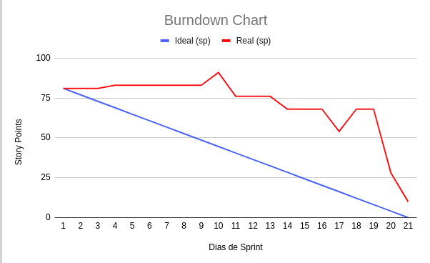

# Sprint 2: 30/09/2024 a 20/10/2024

[Objetivos da Sprint](https://github.com/SQLutions-FATEC/API-2-Semestre/tree/develop-2?tab=readme-ov-file#-objetivos-da-sprint) | [Entregas](https://github.com/SQLutions-FATEC/API-2-Semestre/tree/develop-2?tab=readme-ov-file#%EF%B8%8F-entregas) | [Métricas do Time](https://github.com/SQLutions-FATEC/API-2-Semestre/tree/develop-2?tab=readme-ov-file#-m%C3%A9tricas-do-time) | [Links Úteis](https://github.com/SQLutions-FATEC/API-2-Semestre/tree/develop-2?tab=readme-ov-file#-links-%C3%BAteis)

O projeto se baseia no desenvolvimento de um sistema para avaliação de nota dos alunos no modelo PACER, que haverá dois tipos de atores; professor e aluno. Tendo em visto o entendimento do problema a ser resolvido, a quarta sprint teve foco na TODO.

## 🎯 Objetivos da Sprint

Os requisitos (tanto do cliente como da instituição de ensino) abrangidos por essa sprint são:
- *RF 01*: Alunos preencherem avaliações de outros membros
- *RF 02*: Receber dados das equipes e seus integrantes (arquivo .csv)
- *RNF 01*: Linguagem de programação: Java
- *RNF 02*: Banco de Dados com modelo relacional
- *RNF 03*: Acesso ao Banco de Dados com JDBC

[→ Voltar ao topo](https://github.com/SQLutions-FATEC/API-2-Semestre/tree/develop-2?tab=readme-ov-file#sprint-2-30092024-a-20102024)

## ✔ Entregas

### RF 01: Alunos preencherem avaliações de outros membros

  
<b>Clique aqui para ver detalhes sobre o desenvolvimento deste requisito</b>

   
  Este requisito foi iniciado e finalizado na sprint 2. A funcionalidade permite que um aluno possa visualizar os membros da sua equipe, os requisitos que precisam ser avaliados, e permite que ele dê as devidas notas, dentro dos requisitos especificados. São eles: Nota entre 0 e 3; uma avaliação por critério por membro a cada sprint; após envio, não é permitida edição.
   
  GIF AQUI

---

### RF 02: Receber dados das equipes e seus integrantes (arquivo .csv)

  
<b>Clique aqui para ver detalhes sobre o desenvolvimento deste requisito</b>

   
  Este requisito foi iniciado e finalizado na sprint 2. A funcionalidade permite que um usuário do tipo "Professor" insira um arquivo CSV com as informações dos alunos e da equipe, desta forma, criando usuários do tipo "Aluno", juntamente com seus usuários e senha, e relacionando estes usuários com a entidade "Equipe". O resultado permite que o usuários consigam logar e acessar a tela do RF 01 para avaliar seus colegas de equipe.
   
  GIF AQUI

---

### RNF 02: Banco de Dados com modelo relacional

  
<b>Clique aqui para ver detalhes sobre o desenvolvimento deste requisito</b>

   
  A imagem representa uma atualização sobre as tabelas existentes, quando comparado com a sprint 1. Está mais detalhado, possuindo: Tabelas intermediária "Criterio_semestre" e "Equipe_semestre"; relação da "Pontuacao" com "Equipe"; relação do "Usuario" com "Equipe"; adição de uma tabela "Historico", que no primeiro momento não será utilizada.
   
  

---

[→ Voltar ao topo](https://github.com/SQLutions-FATEC/API-2-Semestre/tree/develop-2?tab=readme-ov-file#sprint-2-30092024-a-20102024)

## 📈 Métricas do time

Nesta sprint foram feitas telas com JavaFX e a conexão com banco, no quesito POST e GET. Com as entregas desta sprint, temos um fluxo de login para o aluno e um para o professor. O cliente poderá fazer adição de alunos e equipes com base em um CSV com formato pré definido, e visualizar estes alunos. O aluno consegue ver os membros de sua equipe, mas ainda não consegue avaliar de fato.

O acompanhamento das atividades é de responsabilidade do Scrum Master (Augusto) e será representado na forma de um gráfico de Burndown. O eixo X representa os dias trabalhados na sprint e o eixo Y representa a quantidade de horas correspondentes para as tarefas da sprint 2. Conforme o gráfico avança no eixo X, pode-se observar que as entregas das atividades ocorrem e devem seguir o máximo possível à linha ideal.

[→ Voltar ao topo](https://github.com/SQLutions-FATEC/API-2-Semestre/tree/develop-2?tab=readme-ov-file#sprint-2-30092024-a-20102024)

## 🔗 Links úteis

Link do [MER](https://drive.google.com/file/d/1GN9CMUtYHpZZ8r1cUnd8weSH0UnCd6-W/view?usp=drive_link)

[→ Voltar ao topo](https://github.com/SQLutions-FATEC/API-2-Semestre/tree/develop-2?tab=readme-ov-file#sprint-2-30092024-a-20102024)
