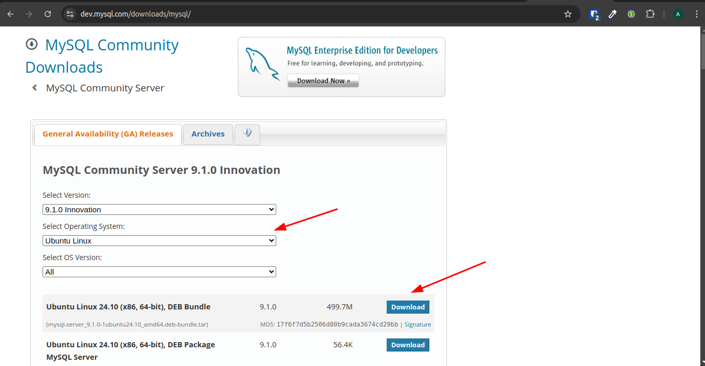
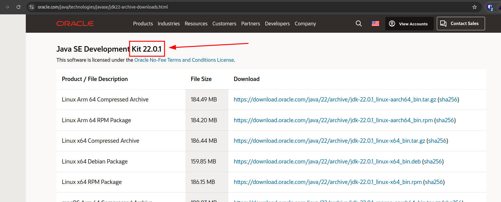
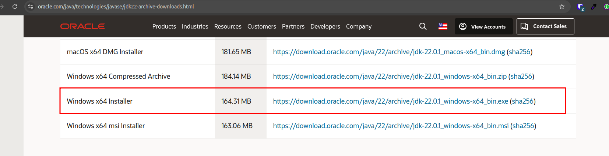
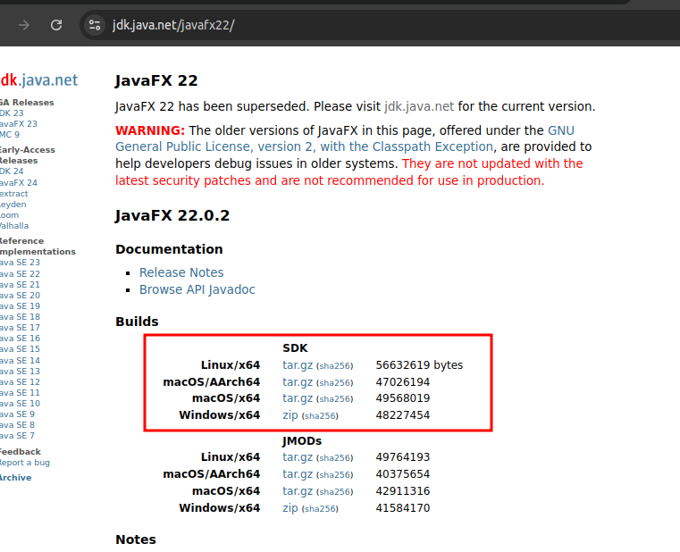

# Como executar o projeto localmente

## Pré-requisitos
- Banco relacional (sugestão MySQL)
- Java versão 22
- JavaFX SDK versão 22.0.2
- Arquivo .jar do projeto SQLutions

### Banco relacional (MySQL)
- Faça o download do MySQL no [link](https://dev.mysql.com/downloads/mysql/)

- Instale o executável baixado, de forma que instale o MySQL Server
- Faça o download do [MySQL Workbench](https://dev.mysql.com/downloads/workbench/) para se ter uma interface para trabalhar com o banco
- Edite a sua conexão com o banco

- Defina as informações como a seguir:
    - Hostname como `localhost`
    - Port como `3306`
    - Username como `root`
    - Password como `admin`
- Teste a conexão e confirme

### Java
- Faça o download do Java 22.0.1 no [link](https://www.oracle.com/java/technologies/javase/jdk22-archive-downloads.html)
    - ATENÇÃO: No topo da página irá aparecer a versão 22.0.2. Vá mais para baixo e procure a versão 22.0.1 e selecione o download compatível com seu sistema operacional, dando preferência sempre para o `Installer`, ou seja, nem o `Compressed Archive` e nem o `msi Installer`
    - 
    - 
- Instale o executável baixado

### JavaFX SDK
- Faça o download do SDK 22.0.2 do seu respectivo sistema operacional no [link](https://jdk.java.net/javafx22/)

- Descomprima o arquivo na pasta desejada
    - ATENÇÃO: Lembre-se de qual pasta salvou este arquivo, pois será utilizado mais pra frente. Por agora, vamos nos referir à esta pasta como `PASTA_SDK`

### .jar
- Faça o download do arquivo [Avaliador de Soft Skill]()

## Execução

- Rode o seu banco localmente
- Rode o arquivo `.jar`
- Passo a passo detalhado para Sistemas Operacionais diferentes abaixo:

---
### Linux
- Abra o terminal
- Digite `sudo systemctl start mysql` e confirme
- Navegue até a pasta em que foi baixado o arquivo `.jar`
    - Provavelmente a pasta "Downloads", sendo assim digite `cd ~/Downloads` e confirme
- Execute o seguinte comando, substituindo o `PASTA_SDK` pela pasta que salvou o arquivo `javafx-sdk-22.0.2` anteriormente:
    - ```java --module-path "PASTA_SDK\javafx-sdk-22.0.2\lib" --add-modules javafx.controls,javafx.fxml -jar avaliador-de-soft-skill.jar```
---
---
### Windows
- Abra o terminal
- Digite `net start mysql` e confirme
- Navegue até a pasta em que foi baixado o arquivo `.jar`
  - Provavelmente a pasta "Downloads", sendo assim digite `cd ~/Downloads` e confirme
- Execute o seguinte comando, substituindo o `PASTA_SDK` pela pasta que salvou o arquivo `javafx-sdk-22.0.2` anteriormente:
  - ```java --module-path "PASTA_SDK\javafx-sdk-22.0.2\lib" --add-modules javafx.controls,javafx.fxml -jar avaliador-de-soft-skill.jar```
---

- Clique no botão de `Preencher banco` para que tenha dados locais para utilizar o projeto
