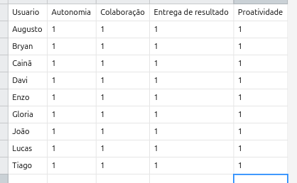

# Detalhes por sprint

## Sprint 1

### 🖋️ Entrega da sprint(DoD):

***Obrigatório:***

- Protótipo da aplicação no Figma

### ❓✅ Dúvidas tiradas com o cliente:

- O professor define o limite de pontos por grupo a cada sprint.
- As avaliações começam após o término da Sprint, com uma semana para conclusão, e o professor gostaria de poder fechá-las manualmente ou automaticamente após o prazo.
- O professor não precisa modificar valores após os cálculos serem feitos.
- A aplicação não tomará nenhuma ação se o aluno tentar acessá-la fora do período de avaliação.
- Não é prioritário o aluno ter acesso às avaliações anteriores feitas por ele.
- Não é essencial gerar gráficos de evolução nas Sprints, sendo suficiente gerar arquivos .csv para análise no Excel.
- Não é necessário gerar relatórios gerais ao final do projeto, apenas relatórios individuais por sprint.
- O professor poderá mover alunos entre equipes, mas excluir alunos não é uma prioridade.
- O professor gostaria de definir as datas de cada sprint e poder editá-las, mas essa funcionalidade não é prioritária.
- Não é necessário que o professor visualize relatórios de alunos que evadiram.

## Sprint 2

### 🖋️ Entrega da sprint(DoD):

***Obrigatório:** A aplicação deve enviar e buscar informações do banco.*

- Documentação para configurar a aplicação em Windows e Linux;
- Cadastro de equipes, incluindo a importação em .csv;
- Tela de avaliação dos membros da equipe.

### 👤User story 1: *Professor importa uma tabela contendo informações dos alunos para poupar tempo e padronizar o envio, cadastrando vários alunos de uma única vez* - 🟡 Prioridade média

- **DoR**:
    - Duas telas no JavaFX:
        - Tela de login para que o usuário selecione se ele é aluno ou professor;
        - Tela do professor para cadastrar equipe contendo um botão para adicionar um arquivo .csv. Deve haver um botão para confirmar o envio. Após o envio, a tela apresenta a equipe cadastrada.
    - Backend que:
        - Recebe as informações, e depois realiza o INSERT no banco de dados;
        - Após realizar o cadastro, o programa irá realizar um SELECT no banco de dados, trazendo as informações para a aplicação.
    - Banco de dados contendo:
        - Tabela de equipe;
        - Tabela de usuário.
- **Dúvidas pertinentes**:
    - O professor prefere cadastrar alunos em grupo, utilizando arquivos .csv.
    - Quando o professor for cadastrar o aluno na aplicação, ele vai inserir o nome, e-mail e a turma. O .csv deve conter o nome e o link do Github da equipe.

### 👤User story 2: *Aluno avalia outros integrantes da equipe a cada sprint numa tabela com linhas referentes aos alunos e colunas referentes aos critérios, para facilitar a visualização e o envio da avaliação e automatizar parte do processo* - 🔴 Prioridade alta

- **DoR**:
    - O cliente deseja que a aplicação importe um .csv contendo a equipe e os alunos do banco de dados
        - Tela no JavaFX:
            - Após selecionar aluno na primeira tela, o usuário terá que colocar o seu email e, caso esteja cadastrado, terá uma tela contendo os outros alunos de seu grupo, que serão sujeitos à sua avaliação.
        - Backend que:
            - Recebe as informações, e depois realiza o INSERT no banco de dados;
        - Banco de dados contendo:
            - Tabela de notas.
- **Dúvidas pertinentes**:
    - Não é uma prioridade permitir que o aluno edite suas respostas após enviar suas notas, mas seria interessante considerar isso no futuro.

### ❓✅ Dúvidas tiradas com o cliente:

- O professor gostaria de ter acesso a projetos anteriores, mas isso não é prioritário, contanto que os dados não sejam apagados.
- A aplicação deve fornecer médias por critério/aluno, com as notas individuais de cada membro da equipe.
- O professor não deve editar a quantidade de sprints depois que ele começar.
- Não é uma prioridade permitir que o aluno edite suas respostas após enviar suas notas, mas seria interessante considerar isso no futuro.
- O professor prefere cadastrar alunos em grupo, utilizando arquivos .csv.
- Quando o professor for cadastrar o aluno na aplicação, ele vai inserir o nome, e-mail e a turma. O .csv deve conter o nome e o link do Github da equipe.
- *Quando iniciamos um semestre novo, o professor vai inserir o ano e o semestre atual; depois, ele irá descrever a quantidade de sprints, e as datas de início e fim de cada uma delas; O professor descreverá os critérios; então, ele vai definir equipes e alunos.*

---

## Sprint 3

### 🖋️ Entrega da sprint:

***Obrigatório:** O aluno deve enviar a avaliação e o professor pode visualizá-la.*

- O professor pode exportar o arquivo .csv contendo as notas.
- O professor pode mover os alunos entre as equipes [inclusive, tirar ele de qualquer equipe em caso de trancar o curso].
- Aluno pode avaliar outro aluno.

### 👤User story 3: *Professor visualiza as médias das notas da equipe por sprint para obter um acompanhamento detalhado e periódico do desempenho das equipes* - 🔴 Prioridade alta

- **DoR**:
    - Front:
        - Seletor de equipe
        - Seletor de semestre
        - Seletor de sprint (travado até preencher o semestre)
        - Seletor de aluno (travado até preencher a sprint. Não é obrigatório preencher esse seletor. Caso este campo esteja vazio, o programa irá retornar a média geral da equipe em determinado semestre, em determinada sprint.)
        - Tabela com as notas para cada critério
        - Tela de edição de aluno
        - Visualização dos atributos do aluno
    - Back:
        - Endpoint de GET para todas equipes
        - Endpoint de GET para todos semestres da equipe selecionada
        - Endpoint de GET para todas sprints do semestre selecionado da equipe selecionada
        - Endpoint de GET para todos alunos da sprint selecionada do semestre selecionado da equipe selecionada
        - Pega os parâmetros dos seletores, monta uma query de GET, busca todas notas registradas referentes ao aluno, calcula a média para cada parâmetro e retorna para o front
    - Banco:
        - Tabela de Equipe
        - Tabela de Aluno
        - Tabela de Semestre
        - Tabela intermediária de equipe e semestre
        - Tabela de Sprint
        - Tabela de Critério
        - Tabela intermediária de critério e semestre
        - Tabela de Nota
        - Tabela de TipoUsuario
- **Dúvidas pertinentes**:
    - O professor não precisa modificar valores após os cálculos serem feitos.
    - Não é necessário gerar relatórios gerais ao final do projeto, apenas relatórios individuais por sprint.
    - O professor gostaria de ter acesso a projetos anteriores, mas isso não é prioritário, contanto que os dados não sejam apagados.
    - A aplicação deve fornecer médias por critério/aluno, com as notas individuais de cada membro da equipe.

### 👤User story 4: *Aluno visualiza o histórico de avaliações para obter um feedback real no andamento do projeto* - 🟢 Prioridade baixa

- **DoR**:
    - Backend:
        - Endpoint de GET para todas as sprints na tela do aluno;
    - Banco de dados:
        - Tabela de Equipe
        - Tabela de Aluno
        - Tabela de Semestre
        - Tabela intermediária de equipe e semestre
        - Tabela de Sprint
        - Tabela de Critério
        - Tabela intermediária de critério e semestre
        - Tabela de Nota
        - Tabela de TipoUsuario
- **Dúvidas pertinentes**:
    - Não é prioritário o aluno ter acesso às avaliações anteriores feitas por ele.

### 👤User story 5: *Professor gerencia alunos e equipes antes do início do projeto para fornecer os acessos aos alunos* - 🔴 Prioridade alta

- **DoR**:
    - Front:
        - Tela de edição de aluno
        - Visualização dos atributos do aluno
    - Back:
        - Endpoint de GET para todas as equipes
        - Endpoint de GET para o nome da equipe
        - Endpoint de GET para o link do Github da equipe
        - Endpoint de GET para todos os alunos da equipe
        - Endpoint de GET para o nome do aluno
        - Endpoint de GET para o email do aluno
        - Endpoint de GET para a senha do aluno
    - Banco:
        - Tabela de Equipe
        - Tabela de Aluno
        - Tabela de Semestre
        - Tabela intermediária de equipe e semestre
        - Tabela de Sprint
- **Dúvidas pertinentes**:
    - O professor poderá mover alunos entre equipes, mas excluir alunos não é uma prioridade.

### 👤User Story 6: *Professor edita os alunos e equipes ao longo do projeto para remanejar alunos entre as equipes* - 🔴 Prioridade alta

Gerar relatórios dos valores calculados

- **DoR**:
    - Front:
        - Tela de edição de aluno
        - Visualização dos atributos do aluno
    - Back:
        - Endpoint de GET para nome do aluno
        - Endpoint de GET para email do aluno
        - Endpoint de GET para equipe do aluno (dropdown com equipes criadas)
    - Banco:
        - Tabela de Equipe
        - Tabela de Aluno
        - Tabela de Semestre
        - Tabela intermediária de equipe e semestre
        - Tabela de Sprint
        - Tabela de Critério
        - Tabela intermediária de critério e semestre
        - Tabela de Nota
        - Tabela de TipoUsuario
    - Controles:
        - Professor não pode inserir e-mails iguais aos que já foram cadastrados no banco
        - Professor
- **Dúvidas pertinentes**:
    - O professor poderá mover alunos entre equipes, mas excluir alunos não é uma prioridade.
    - Não é necessário que o professor visualize relatórios de alunos que evadiram.

### 👤User story 7: Professor exporta arquivo .csv para visualizar melhor os relatórios - 🔴Prioridade alta

- **DoR**:
    - Front:
        - Botão para exportar relatório
    - Back:
        - Captação de critérios para aquele período, em específico.
    - Banco:
        - Tabela de Equipe
        - Tabela de Aluno
        - Tabela de Semestre
        - Tabela intermediária de equipe e semestre
        - Tabela de Sprint
        - Tabela de Critério
        - Tabela intermediária de critério e semestre
        - Tabela de Nota
        - Tabela de TipoUsuario
- **Dúvidas pertinentes**:
    - Formato do .csv na

### ❓✅ Dúvidas tiradas com o cliente:

- Tela de criação de sprint, que vai conter o seguinte fluxo:
    - O professor cria a primeira sprint, define sua data inicial e final. Ao confirmar a criação, o programa apresenta que está criando a sprint seguinte. O professor define a sprint inicial, que será posterior à data final da sprint anterior, e define a data final da sprint. Assim, o programa se repete por quantas sprints se fizerem necessárias;
- A tela de definição de critérios, que funcionará assim:
    - O professor cria critérios com o nome e uma breve descrição. Os critérios ficarão à mostra numa tabela, onde o professor seleciona quais critérios serão avaliados no período selecionado naquela tela;
- O modelo do arquivo .csv, que será apresentado no seguinte formato:

---

## Sprint 4

### 🖋️ Entrega da sprint:

***Obrigatório:** O professor pode definir datas das sprints e critérios*

- Usuário pode fazer login
- Professor pode editar sprints

### 👤User story 8: *Professor define as datas de cada sprint para definir controles sobre o período de acesso dos alunos na plataforma* - 🔴Prioridade média

- **DoR**:
    - A aplicação irá mostrar ao usuário que ele irá criar a sprint número 1. O usuário deve definir a data de início e fim do projeto, e então confirmar aquela sprint, que será inserida no banco de dados. Após a criação da primeira sprint, a aplicação indica a criação da sprint 2. O usuário insere a data de início, que deve ser posterior à data final da sprint anterior. O usuário confirma as alterações, e o programa repete essa lógica por até 8 sprints.
    - **Controles importantes:**
        - O usuário não pode definir data de início e fim iguais para uma sprint;
        - O usuário não pode criar uma sprint com data final anterior à data final da última sprint cadastrada;
        - O usuário pode criar, no máximo, 8 sprints.
        - O usuário deve inserir as datas para criar uma sprint nova.
    - **A interface deve conter:**
        - Campo para definir data de início;
        - Campo para definir data final;
        - Tabela contendo as sprints criadas;
        - Botão para voltar;
        - Botão para confirmar criação de sprint.
- **Dúvidas pertinentes**:
    - Dúvidas relacionadas à essa user story

### 👤User story 9: *Professor edita as datas de cada sprint para contornar imprevistos que venham a surgir no calendário acadêmico* - 🔴 Prioridade alta

- **DoR**:
    - **Resumo:**
        - O professor pode precisar editar as datas das sprints ao longo do projeto. Para isso, teremos uma tela dedicada à edição dessas datas.
        - O professor deve selecionar o fim ou o início de uma sprint. Ao editar o final de uma sprint que contenha uma outra sprint subsequente, a próxima sprint deve ter a sua data de início configurada para um dia depois da data final da sprint editada. O mesmo deve ocorrer na data de início de uma sprint que contenha uma sprint anterior.
    - **Controles importantes:**
        - A aplicação deve travar a seleção de datas que já passaram;
        - A aplicação não pode permitir a escolha de datas anteriores à data atual;
        - As sprints não podem ter gaps entre elas. Sempre que uma termina, outra se inicia no dia seguinte.
    - **A interface deve conter:**
        - Label indicando o período que está sendo visualizado;
        - Seleção de data a ser editada;
        - Campo para fazer alteração;
        - Botão de confirmação;
        - Botão para voltar.
- **Dúvidas pertinentes**:
  - 

### 👤User story 10: *Usuário faz login com sua credencial para acessar funcionalidades que correspondam à função do usuário* - 🟡 Prioridade média

- **DoR**:
    - Para que o usuário diga à aplicação quem ele é, devemos ter uma tela de login. O aluno deve digitar o seu e-mail previamente cadastrado por um professor, e o professor terá o seu login injetado manualmente no banco de dados.
    - **Controles importantes:**
        - A aplicação deve acusar ‘E-mail e/ou senha inválidos’ caso o banco não retorne nenhum registro;
        - Se possível, a aplicação deve acusar quando o usuário digitado está fora do padrão de um e-mail.
    - **A interface deve conter:**
        - Campo para digitar o e-mail;
        - Campo do tipo senha para a senha;
        - Botão de confirmar.
- **Dúvidas pertinentes**:
    - Dúvidas relacionadas à essa user story

### 👤User story 11: Professor cria e seleciona critérios que serão avaliados entre os integrantes da equipe - 🔴 Prioridade alta

- **DoR**:
    - **Resumo**
        - O cliente solicitou a opção de criar diversos critérios para serem utilizados no desenvolvimento do projeto. Para isso, criaremos um sistema onde o professor pode criar critérios que serão visualizados em uma lista. Ao selecionar um período, a tabela contendo os critérios mostrará checkboxes para que o usuário selecione quais critérios ele quer que sejam considerados naquela sprint.
    - **Controles importantes:**
        - O professor não pode criar critérios com nome ou descrição vazios.
    - **A interface deve conter:**
        - Textbox para nome do critério;
        - Textfield para descrição;
        - Tabela contendo critérios criados;
        - Checkboxes para sinalizar quais critérios estão sendo utilizados.
- **Dúvidas pertinentes**:
    - Dúvidas relacionadas à essa user story

### ❓✅ Dúvidas tiradas com o cliente:

-

---